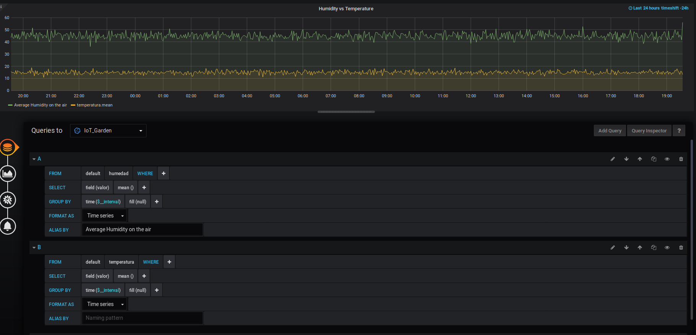

# TC3041-P4-Primavera-2019

Antony Adrian Morales

Alberto Pascal

# Problema
El huerto urbano, equiparable al huerto en el jardín, en su concepto se trata de espacios cubiertos o no, para el cultivo de flores, aromáticas, hortalizas y frutales a escala doméstica. Para las personas principiantes resulta un tarea ardua estar al pendiente y conseguir los resultados esperados. La solucion inteligente ayuda a las plantas y cultivos a florecer. Sensores incorporados que monitorean el cultivo todo el día. 

# Descripción de las mediciones
## Series
- Humedad capacitiva del suelo
- Temperatura del ambiente
- UV luz solar

## Tags
- sensor = < numero-de-sensor >
- marca = < marca-de-sensor >

## Valores (measurements)
- Humedad: valor = < Rango 0 to 50% >
- Temp: valor = < temperatura en Cº >
- UV: valor = < μmol >

# Contribuir
## Requisitos previos
- Docker
- Python 3.7.3

## Ejecutar contenedores
- `docker run --name influxP4 -d -p 8086:8086 -v $HOME:/var/lib/influxdb influxdb`
- `docker run -d  -p 3000:3000 --name=grafana -e "GF_SERVER_ROOT_URL=http://grafana.server.name" -e "GF_SECURITY_ADMIN_PASSWORD=secret" grafana/grafana`

## Generar dataset
- `python3 ./Create_Data.py`

## Importar dataset al contenedor de InfluxDB
- Ir a la ruta donde se creó el archivo iot_garden_database.log
- Copiar el dataset al contenedor con `sudo docker cp iot_garden_database.log influxP4:/var/lib/influxdb/`

## Importar los datos a la base de influx:
- Entrar al bash de influx: `docker exec -it influxP4 bash`
- Importar los datos mediante el comando `influx -import -path=/var/lib/influxdb/iot_garden_dataset.log -precision=ns`
- Acceder a la base de datos `influx`

## Para verificar que los datos se hayan insertado
- Se puede ejecutar el query: `use iot_garden_dataset`
- `Select count(*) from humedad`

## Grafana
1. Ingresar a grafana: [http://localhost:3000](http://localhost:3000)
2. Credenciales:
    - Username: `admin`
    - Password: `secret`
3. Configurar:

    

##Previsualización de las gráficas

    

##Configuración de las gráficas

    

    
    
    

    

    

    
